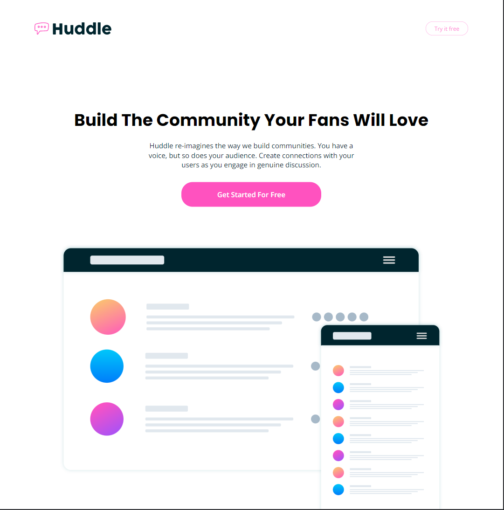

# Frontend Mentor - Huddle landing page with curved sections solution

This is a solution to the [Huddle landing page with curved sections challenge on Frontend Mentor](https://www.frontendmentor.io/challenges/huddle-landing-page-with-curved-sections-5ca5ecd01e82137ec91a50f2). Frontend Mentor challenges help you improve your coding skills by building realistic projects.

## Table of contents

- [Overview](#overview)
  - [The challenge](#the-challenge)
  - [Screenshot](#screenshot)
  - [Links](#links)
- [My process](#my-process)
  - [Built with](#built-with)
  - [What I learned](#what-i-learned)
  - [Useful resources](#useful-resources)
- [Author](#author)

## Overview

### The challenge

Users should be able to:

- View the optimal layout for the site depending on their device's screen size
- See hover states for all interactive elements on the page

### Screenshot

### Links

- Solution URL: [https://github.com/EseAlli/huddle-curved](https://github.com/EseAlli/huddle-curved)
- Live Site URL: [https://esealli.github.io/huddle-curved/](https://esealli.github.io/huddle-curved)

## My process

### Built with

- Semantic HTML5 markup
- CSS custom properties
- Flexbox
- Mobile-first workflow

### What I learned

When to leave the alt attribute of an image empty, there is a decision tree that can help you decide whether or not to add an alternative text for the image

### Useful resources

- [Alt Decision Tree and Alternative Text Guide](https://www.hmc.edu/communications/accessibility-resources/alt-decision-tree-alternative-text-guide/) - This Alt Decision Tree and Alternative Text Guide, helped undesrtand the correct use of alternative text for images within web pages.

## Author

- Website - [Eseoghene Alli](https://esealli.github.io/)
- Frontend Mentor - [@EseAlli](https://www.frontendmentor.io/profile/EseAlli)
